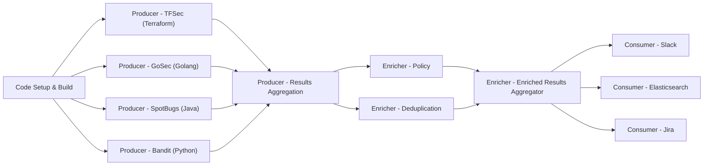

  

  

# Dracon

By [Ocurity](https://ocurity.com)
Security scanning,results unification and enrichment tool ([ASOC](https://www.gartner.com/reviews/market/application-security-orchestration-and-correlation-asoc-tools)) - forked and rewritten from @thought-machine/dracon

Security pipelines on Kubernetes. The purpose of this project is to provide a
scalable and flexible framework to execute arbitrary security scanning tools on code and infrastructure while
processing the results in a versatile way.

# Getting Started

The [Getting started with KinD][tut-kind] tutorial explains how to get started with Dracon.
You can also access our community contributed pipelines [here](https://github.com/ocurity/dracon-community-pipelines)

More tutorials:

| Name                                                  | Description                                                          |
| ----------------------------------------------------- | -------------------------------------------------------------------- |
| [Getting started with KinD][tut-kind]                 | Quickstart guide on how to get started with Dracon using KinD        |
| [Getting started with Please and K3D][tut-please-k3d] | Beginner guide on how to get started with Dracon using Please w/ K3D |
| [Running our demo pipeline][tut-running-demos]        | End to end demo of running an example pipeline                       |

## Announcements

This version of Dracon was announced at OWASP Appsec Dublin in 2023. Check out [the slides](docs/presentations/Global_AppSecDublin_Presentation.pdf) and [the video](https://www.youtube.com/watch?app=desktop&list=PLpr-xdpM8wG8479ud_l4W93WU5MP2bg78&v=i9j7n0WDBO0&feature=youtu.be) of the presentation.

# Support

If you have questions, reach out to us by opening a new [issue](https://github.com/ocurity/dracon/issues/new) on Github.

# Development & Contributing

Contributions are welcome, see the [developing](docs/contributers/DEVELOPING.md)
and [releasing](docs/contributers/RELEASES.md) guides on how to get started.

# License

Dracon is under the Apache 2.0 license. See the [LICENSE](LICENSE) file for
details.

[tut-kind]: docs/getting-started/kind.md
[tut-please-k3d]: docs/getting-started/please-k3d.md
[tut-running-demos]: docs/getting-started/tutorials/running-demos.md
