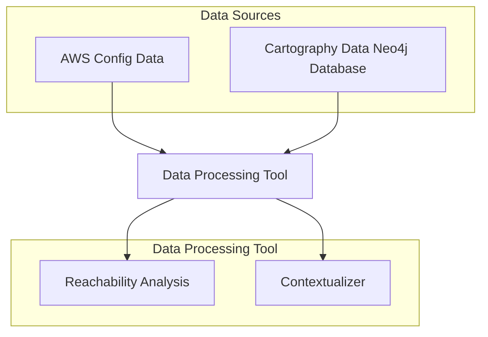

# CloudPI

## Introduction

The purpose of this new plugin for Dracon is to add contextualized cloud scanning capabilities to it. The first working version of CloudPI will support limited services in AWS:

<add list of services that will be supported>

CloudPI will gather information in the source AWS account. It will check for misconfigurations and it will perform an exploitability analysis that will help the end user prioritize the many misconfigurations that can appear in a cloud set up.

In the future, CloudPI will be expanded by supporting more cloud vendors, supporting more services and adding additional capabilities.

## Design

In this initial iteration for CloudPI, it will gather the information from AWSConfig service in AWS. There are AWS managed config rules that cover the baseline for misconfigurations in AWS, not all of them will be supported by CloudPI in this first iteration, only those that apply to the following AWS services `ec2`, `ecs`, `vpc`, `lambda`, `rds` and `redshift` (TBD). CloudPI will:

1. Be configured by the user with the AWS Credentials required to connect to the AWS account.
2. Retrieve the status of AWSConfig rules and misconfigurations.
3. Query for non-compliant AWS resources and extract its dependencies with `cartography`. This step will make use of the previous executions and will only updated the new resources and dependencies since the last execution.
4. Perform an exploitability analysis of the non-compliant resources based on the graph generated by cartography and the information coming from AWS Config.

### Components

#### AWSConfig rules

AWSConfig will detect misconfigurations in the cloud, AWS comes with a set of predefined rules that CloudPI will make use of for identifying security issues in the account.

#### Cartography

Cartography is a python tool that creates graph of your AWS resources, CloudPI will make use of it for knowing the dependencies between resources and for performing the exploitability assesment.

##### Neo4j

Cartography requires a Neo4j database for storing its graphs.

### Diagram

## Implementation

The main piece of work that is part of this feature is to perform the exploitability analysis. It will require several assesments:

- Assess whether the vulnerable resource is accessible from the internet.
- Assess whether there are additional security measures in place that prevents exploitability of the misconfiguration.
- Assess wether the vulnerable resource is exploitable in the context it is deployed.

Apart from discover whether a resource is exploitable. CloudPI will prioritise findings based on both, severity of the issue and importance of the resource (i.e: production resource). The criticality of the resource will be based on custom tags that the user will define.

### Implementation Details

- **Producers:** 
  - **AWSConfig**: This producer will deploy and retrieve information about the AWSConfig rules that will be used to detect misconfigurations in the cloud.
  - **Cartography**: This producer will retrieve the dependencies of the resources that are found nor compliant by the AWSConfig rules.
- **Enrichers**:
  - **AWSreachability**: It performs the reachability assesment described in the previous section.
  - **AWSexploitability**: It performs the exploitability assesment, it adds all context to the vulnerability and, given it's reachable, it checks wether it's exploitable

<add iam policy with minimum permissions for CloudPI to work>
